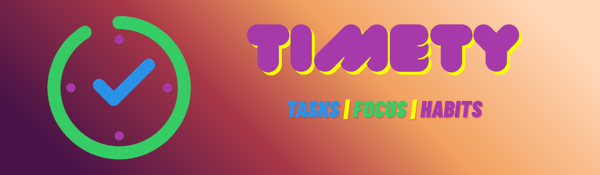
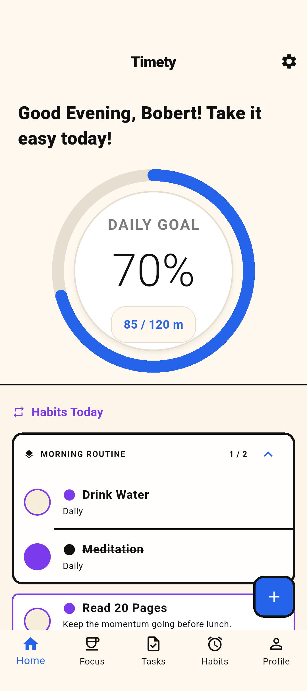
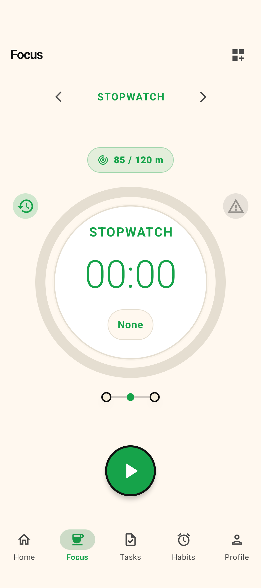
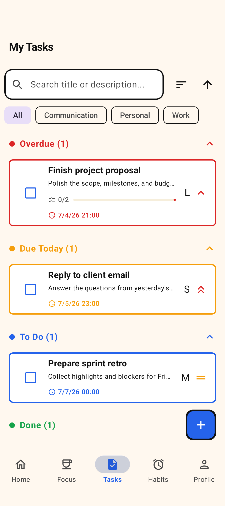
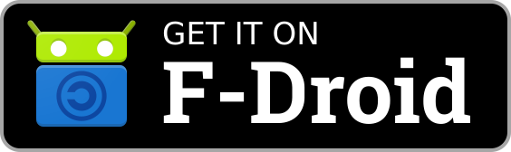

# Timety

<p align="center">
  
  <p align="center">
    <a href="https://github.com/Benji377/Timety/actions/workflows/ci.yml">
      
    </a>
    <a href="https://github.com/Benji377/Timety/actions/workflows/dependency-submission.yml">
      
    </a>
    <a href="https://github.com/Benji377/Timety/releases">
      
    </a>
    <br>
    <a href="https://tally.so/r/ODbEoA">
      
    </a>
    <a href="https://crowdin.com/project/timety">
      
    </a>
    <a href="mailto:apptimety@gmail.com">
      
    </a>
  </p>
</p>

Timety is an offline-first productivity and time-management application built with Kotlin for Android. It integrates Task Management, Focus Sessions, and Habit Tracking into one beautiful, gamified experience.

<p align="center">
  
  
  
</p>
<p align="center">
  <em>View the <a href="screenshots/output/">full screenshot gallery</a> to see the calendar, analytics, profile, and more!</em>
</p>

## Features

*   **Intelligent Task Management:** Organize one-off tasks with due dates, priority levels, and effort sizes.
*   **Focus Engine:** A robust stopwatch and timer system tailored for deep work. Includes support for tags, custom modes, and short/long break phases.
*   **Habit Tracker:** Build lasting routines with flexible frequencies (daily, specific weekdays, or flexible weekly goals).
*   **Rich Analytics:** Visualize your productivity with interactive charts, weekly velocity metrics, and time-of-day habit analysis.
*   **Gamification:** Track your active days, build streaks, and level up your productivity profile.
*   **Smart Notifications:** Local reminders for tasks, specific habit times, and dynamic daily motivation.
*   **Unified Calendar:** A custom micro-dot calendar view to see your tasks, focus sessions, and habits at a glance.

## Download & Installation

> [!TIP]
> 🇨🇳 **Users in China:** Having trouble downloading or updating? See the [China Download & Update Guide (F-Droid Mirrors)](https://github.com/Benji377/Timety/discussions/81)

Choose your preferred way to stay productive.

<p align="left">
  <a href="https://f-droid.org/packages/io.github.benji377.timety">
    
  </a>
  <a href="https://github.com/Benji377/Timety/releases/latest">
    
  </a>
  <a href="https://sourceforge.net/p/timety/">
    
  </a>
</p>

### Manual Installation (GitHub Releases)

1. Go to the **[GitHub Latest Release Page](https://github.com/Benji377/Timety/releases/latest)**.
2. Scroll down to the **Assets** section.
3. Download the `.apk` file (the universal APK works on all devices).
   *(Note: The `.aab` file is for app stores and bundle installers; most users should download the `.apk`)*

#### **How to install:**
1. Download the `.apk` file.
2. Open the file on your Android device.
3. If prompted, enable "Install from Unknown Sources" in your settings.
4. Follow the on-screen instructions to finish.

## Installation and Setup

### Prerequisites
*   Android Studio
*   Java 17
*   Android SDK

### Build Instructions

1.  Clone the repository:
    ```bash
    git clone https://github.com/Benji377/Timety.git
    cd Timety
    ```

2.  Open the project in Android Studio.

3.  Sync Gradle dependencies.

4.  Run the application on an emulator or a physical device:
    ```bash
    ./gradlew installDebug
    ```

## Development & Roadmap

Want to see what's coming next or contribute to Timety?

Check out the **[Timety GitHub Project Board](https://github.com/users/Benji377/projects/7)**! There, you can track the live status of all planned features, bugs, and enhancements, complete with priority tags and issue sizing.

## Community & Discussions

Join the conversation! Whether you need help, want to share how you use Timety, or have a brilliant idea for a new feature, our **[GitHub Discussions](https://github.com/Benji377/Timety/discussions)** is the place to be.

* **📢 Announcements:** Stay up to date with the latest releases and major changes.
* **💡 Ideas:** Suggest and vote on new features you'd love to see.
* **🙏 Q&A:** Ask questions and get help from the community or the developer.

## Translations

Help us bring Timety to your native language! We use Crowdin to manage our localization, making it incredibly easy to contribute translations without touching any code.

How to contribute:
1. Visit the **[Timety Crowdin Project](https://crowdin.com/project/timety)**.
2. Select your language and start translating!
3. If your language isn't listed, feel free to request it directly on Crowdin.

*Note: If you ever need context for a specific word or phrase, drop by our GitHub Discussions and ask!*

## Privacy
Timety is proudly **Offline-First**. All of your tasks, habits, and focus history are stored securely on your local device using Room. No accounts, no cloud sync, no tracking.
