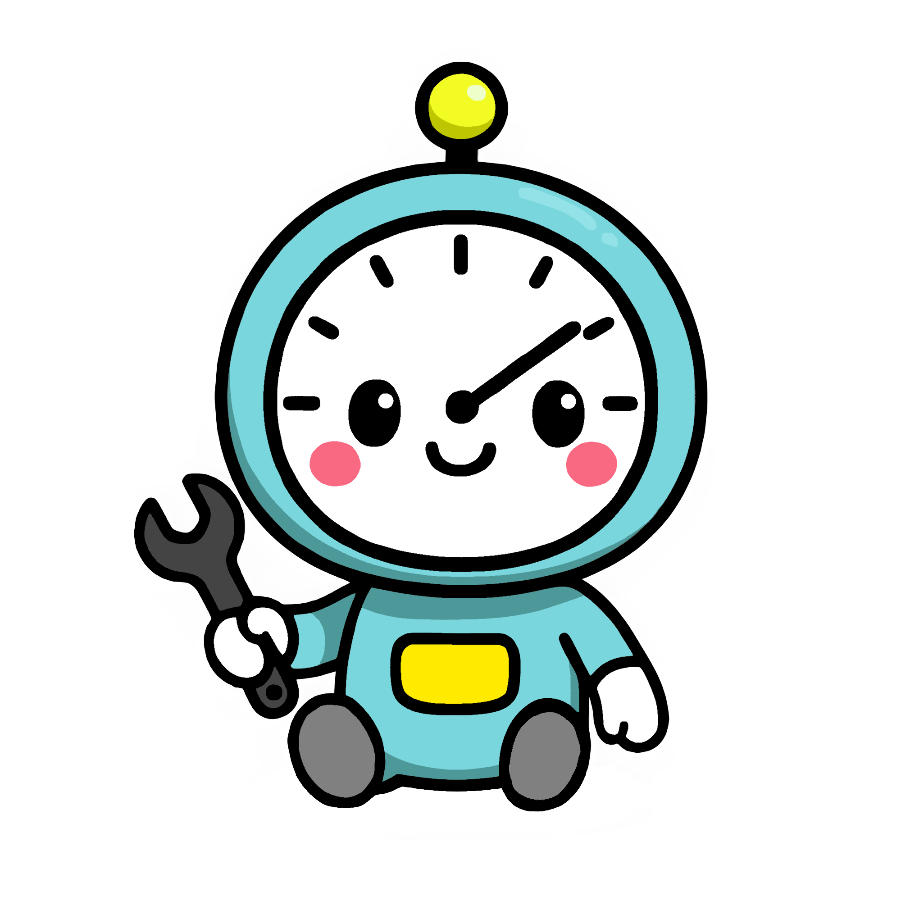

# :timer_clock: Timety

  

> [!CAUTION]
> **:warning: Very early development! Do not use! :warning:**

## Introduction
Timety is a small time tracking app with a couple more features than your ususal clock. For once, the app has a calendar, a tasks list with reminders and a pomodoro timer to track your focus. But additionally, the app also has a leveling system with achievements and titles to flex on your unproductive friends!
All this for free, offline and open-source. No data is collected and everything is stored on your device for maximum security and privacy, you are in control!

Check out the [Roadmap](https://github.com/users/Benji377/projects/6) to find out at which state the app currently is.

## Getting Started

### For Developers
Follow our guide on the Wiki to indstall all the necessary tools and getting started on working on the Timety project. Its not as difficult as it seems, we promise!

### For Regular Users
Simply download the latest release from the release page and install the apk as a regular app on your device. We will try and provide app store support in the future, but for now thats the only way

## Helpful links
- Documentation (GitHub Wiki): https://github.com/Benji377/Timety/wiki
- Project Timeline: https://github.com/users/Benji377/projects/6
