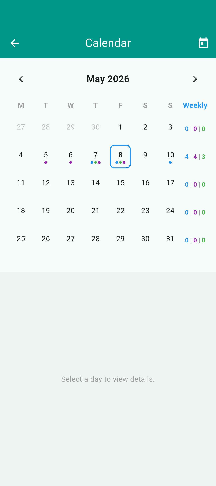
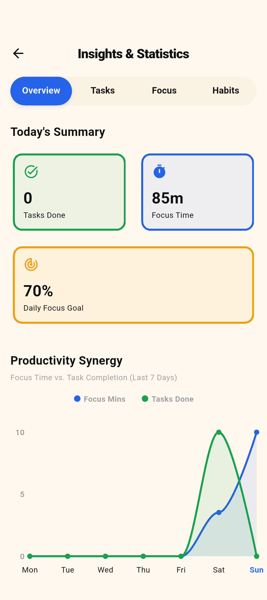
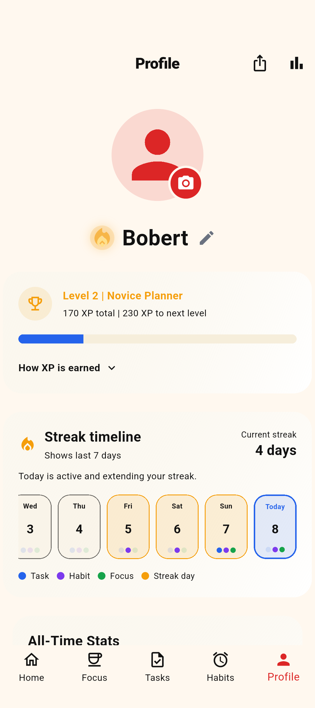
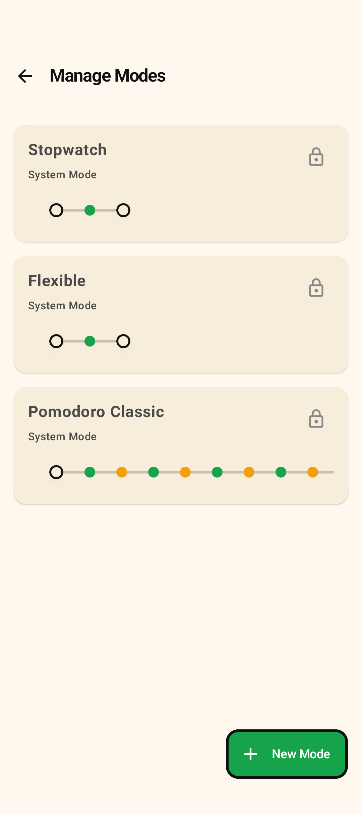
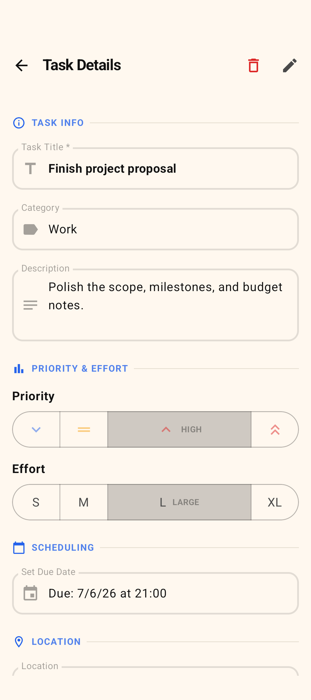
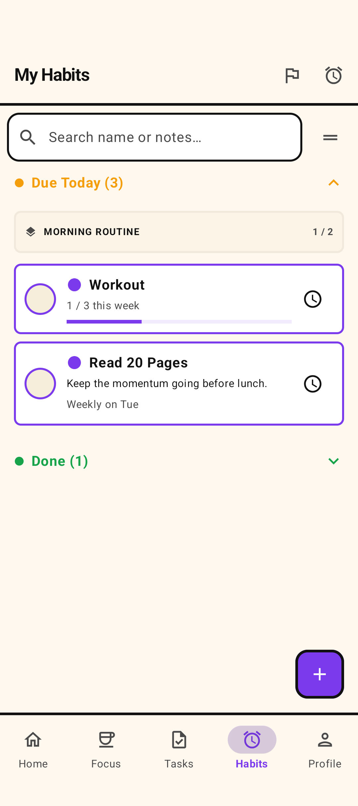
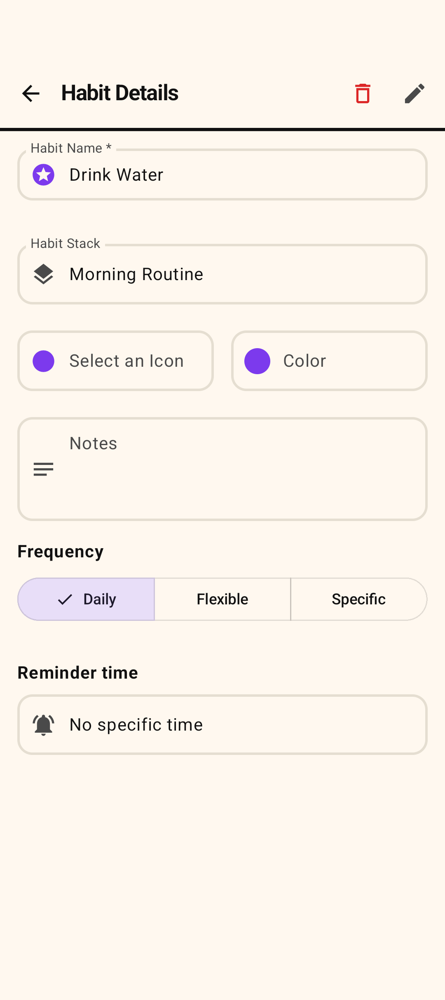

# Screenshots Gallery

Welcome to the full gallery of Timety's interface! Here is a closer look at the different features and screens that make up the application.

## Generated Screenshots

> The screenshots are taken automatically using Android UI testing tools in light mode, but Timety also supports dark mode!

---

## Dashboard & Overview

  
  

  
  

---

## Focus Sessions

  
  

---

## Task Management

  
  

---

## Habit Tracking

  
  

---
*Return to the [Main README](../../README.md).*
